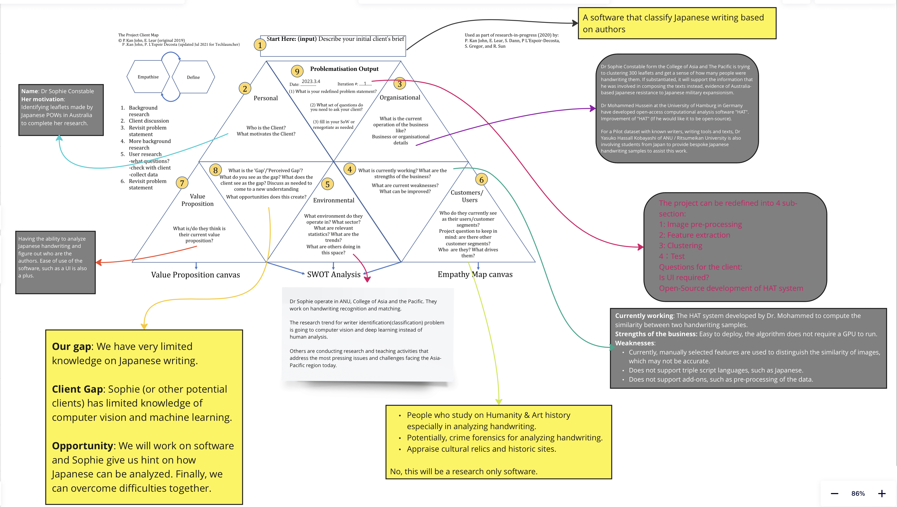

# International collaborate on hand-writing project

User document: see How_to_run_the_project.pdf

### 1. MileStones and Current Objective:

*Milestones*

#### details image preprocessing: 

Image preprocessing is crucial for the Pair Creation stage, as it enhances the quality of images through contrast enhancement and sharpening, making important features more prominent. This aids in accurate recognition and learning of information within the images by the model. Additionally, image normalization ensures that the pixel values across all images are within the same range, promoting data consistency and stabilizing model training. The denoising and background removal in preprocessing reduce interference in the images, enabling the model to focus more on the primary content of the images, thereby generating clearer and cleaner image pairs during the Pair Creation stage. This not only improves computational efficiency and accelerates the generation of positive and negative image pairs, but also allows for visual inspection to verify the effects of preprocessing, ensuring that high-quality and consistent image data is provided for model training.
see details: confluence report[(https://international-japanese-collab.atlassian.net/wiki/spaces/LP/pages/28311553/Report+on+OCR+method+progress+plan+and+constraints)]

#### Branch out (Siamese Neural Network):
Training a Siamese neural network for handwriting analysis to identify whether two Japanese characters are written by the same person involves several steps. Below is a general guideline:

Overview of Siamese Neural Network

A Siamese neural network consists of two identical subnetworks, which are used to extract features from two input images. The outputs of these subnetworks are then compared to compute a similarity score, which is used to determine whether the two input images are similar or dissimilar.
see details: confluence report[(https://international-japanese-collab.atlassian.net/wiki/spaces/LP/pages/28213266/Siamese+Neural+Network)]
 

#### Branch out (OCR method):
Our current approach is outlined in the project milestones. We believe that the cropped images we are using are sufficient for our present needs. After initial image preprocessing, we employ the OCR method provided by Google's API to recognize each character. Following this, we evaluate the accuracy using our API and identify various constraints. Our future steps involve the implementation of a neural network that encodes images into vectors, which will then be used to train our model. Subsequently, we will apply clustering techniques we learned last semester to obtain clustering results.
see details: confluence report[(https://international-japanese-collab.atlassian.net/wiki/spaces/LP/pages/28311553/Report+on+OCR+method+progress+plan+and+constraints)]

#### Branch out (image encoding):
Based on the recommendation of Dr. Mohammed, we sought to enhance the original set of images through various techniques, such as increasing contrast and binarization. The objective was to investigate the potential benefits of these enhancements on the embeddings produced by the CLIP model. By examining the cosine similarity between embeddings, we aimed to determine the most effective enhancement method.
see details: confluence report[(https://international-japanese-collab.atlassian.net/wiki/spaces/LP/pages/27754508/Report+on+Image+Enhancement+Techniques+for+Improved+Embeddings)]

#### The following paragraph is being maintained by group monitors
### 2. Workspace and Communication channels:

OLD landing page: https://docs.google.com/document/d/1IfB7Yy_RHFtP7vITMqCr6VszqwX8z4nqkPvJ8s6wOA0/edit

**Below is the link to the NEW landing page and the credentials necessary to log in and see the page.**

**Landing page (Confluence): https://international-japanese-collab.atlassian.net/wiki/spaces/LP/overview**

**Username: theinternationalconfluence@gmail.com**

**Password: confluence321**

-----------------
Google Drive:https://drive.google.com/drive/folders/1hecIuxT4ad-6tQBP7q64SHWG3DRKsFKW

Miro: https://miro.com/app/board/uXjVPjUkjFU=/?share_link_id=70743626073
*problematisation*
 
Statement of Work(also linked within landing page): https://docs.google.com/document/d/1EtdTE8EcNiLc0zZhhfSrFLprn_pdXndhCRASWU9sTWw/edit?pli=1#heading=h.rp8cc29r2wlp
 
project management tools: Mondays,GitHubbranches, discord, and Slack(previously)
 
Communication channels: 

Discord channel: [https://discord.gg/FKX85jvkdy](https://discord.gg/sBrUTEFzvF) 

Slack workspace (prev): https://anutechlaunch-ye91222.slack.com/archives/C04QZCV0F7W
